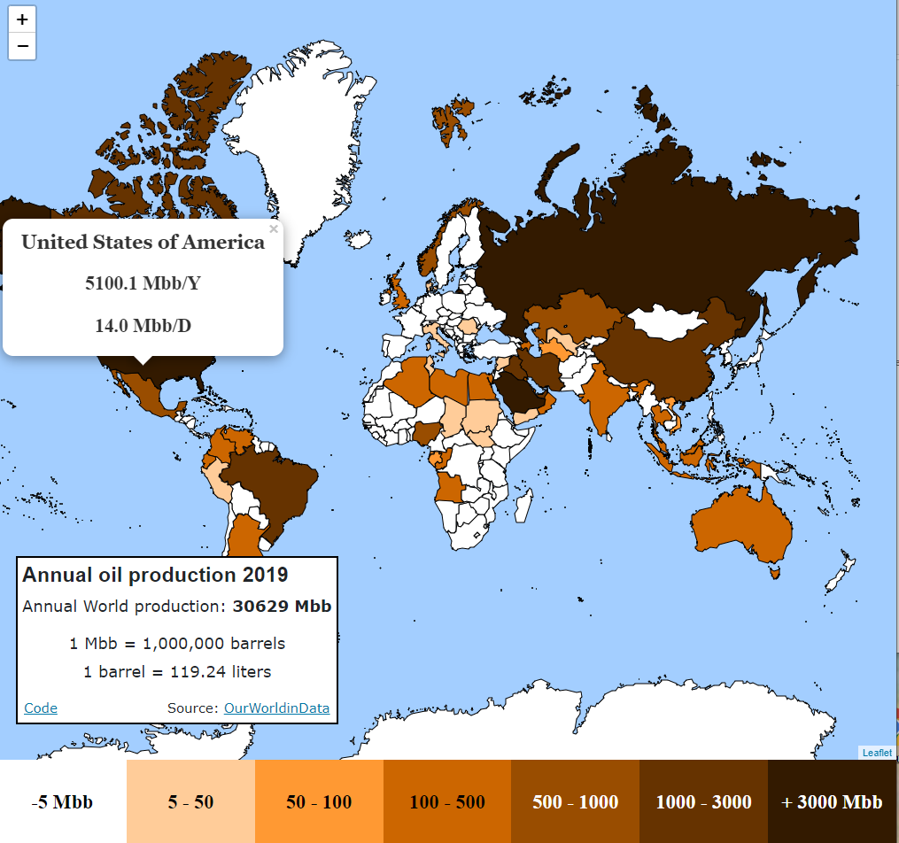

## World oil production by country Web map using React Leaflet, React Hooks without classes, GeoJson and Papa Parse.

### Classes from previous project transformed to functions.
Web:

[https://josepansabate.github.io/React-Leaflet-World-Oil-Production-Functional-Hooks/](https://josepansabate.github.io/React-Leaflet-World-Oil-Production-Functional-Hooks/)

Font: 
[https://ourworldindata.org/grapher/oil-production-by-country](https://ourworldindata.org/grapher/oil-production-by-country)

Update:
npm run deploy 

gh-pages

"private":"...",
"homepage":"http://JosepAnSabate.github.io/React-Leaflet-World-Oil-Production-Functional-Hooks",

   "scripts": {
    "predeploy":"npm run build",
    "deploy":"gh-pages -d build",

npm run deploy