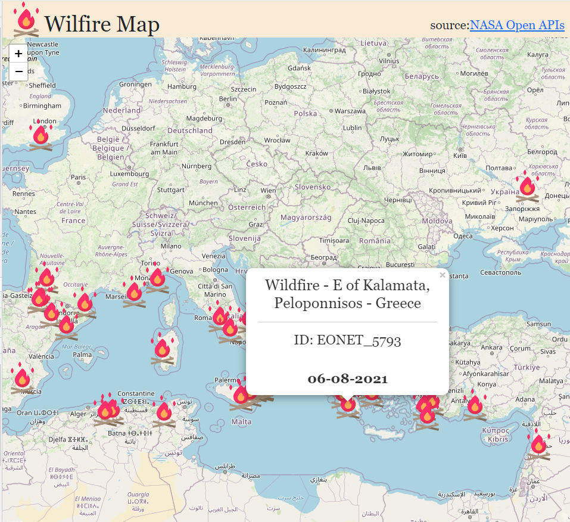

# Wildfire Map Tracker using NASA Open APIs, with React-Leaflet.

### Source:
Open APIs NASA: [https://api.nasa.gov/](https://api.nasa.gov/)

Wild  events: [https://eonet.gsfc.nasa.gov/api/v2.1/events](https://eonet.gsfc.nasa.gov/api/v2.1/events)

